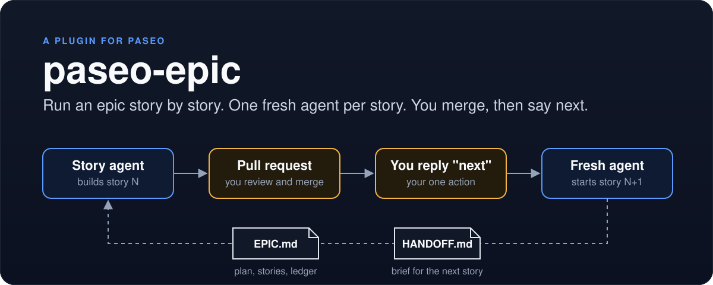

<p align="center"></p>

Run an epic story by story in [Paseo](https://paseo.sh): one fresh agent per story, one merge and one word from you between stories.

**Status:** v0.1 · needs Paseo >= 0.10.2 · MIT license · built for a single user on one daemon.

## What it is

`paseo-epic` is a native Paseo plugin (plugin id `epic`). It runs an epic, an
ordered list of user stories, one story at a time on one epic branch. Every
story gets a fresh agent in its own worktree. The human gate is the pull
request merge: you merge the story PR, then reply `next`, and the plugin
starts the agent for the next story. Two files in your repo carry all the
state: `EPIC.md` (the plan and the history) and `HANDOFF.md` (the brief for
the next story).

## Why

Without a routine, a long epic goes wrong in the same few ways:

- **Context rot.** One agent session that runs story after story fills up
  with old detail. Its later work gets worse.
- **Stale plans.** The plan for story 3 was written before story 2 shipped.
  Nobody updates it with what story 2 actually built, changed, or skipped.
- **Retyped context.** You start each new session by explaining the epic
  again, by hand, from memory.

What the plugin gives you:

- **A handoff at every close.** The agent that built the story writes
  `HANDOFF.md` while it still knows the details: what shipped, what changed
  in the plan, the brief for the next story, and the traps it found.
- **A fresh agent per story.** It starts from the merged handoff, not from a
  long chat history.
- **Guard rails.** `start` and `next` read the package from the pushed epic
  branch and refuse when it is stale or inconsistent: a dirty tree, a
  failed check, the wrong next story, a handoff that points elsewhere, or
  another story PR still open (checked when `gh` is installed).
- **One human touch per story.** You merge the PR and reply `next`.
  Everything else is the agent's job or the plugin's job.

## How it works

```
  /epic init --> plan stories --> /epic start --> build --> /epic close
                                       ^                         |
                                       |                         v
                          fresh agent, new worktree        story PR opened
                                       ^                         |
                                       |                         v
                                 reply "next" <------------- you merge
```

At close, the agent updates the story row and the ledger in `EPIC.md` and
rewrites `HANDOFF.md`. `epic_close` commits, pushes, and opens the story PR
into the epic branch. After you merge and reply `next`, the plugin creates a
worktree on a new story branch and starts an agent there. Its first prompt is
`/epic start <story>`, then the merged PR's conversation comments.

Three kinds of caller use the plugin:

| Caller | What it uses |
| --- | --- |
| You (human) | The **Epic** workspace panel (it also opens the story's workspace and agent), the `/epic <verb> [id]` slash command, and the Command Center item **Epic: start next story** |
| The agent | The seven `epic_*` tools of the `epic` MCP server |
| The plugin itself | An `agent.create` hook that adds the `epic` MCP server to new agents in a repo with `.epic.yml` or an epic package, and an `agent.turn_ended` hook that spawns the next story's agent after `epic_next` |

> [!IMPORTANT]
> This plugin is for **one person running one epic on one daemon**. One story
> is in flight at a time, one agent builds it, one human merges. There are no
> locks, no assignments, and no per-member state. Do not share one epic
> between several people.

## Install

You need Paseo 0.10.2 or newer.

From GitHub. Paseo runs the build step from `paseo-plugin.json`
(`npm ci --omit=dev`):

```bash
paseo plugin install github:thanh-dong/paseo-epic
```

From a local clone. A local-path install does not run the build step, and
the server bundle needs `yaml` from the clone's `node_modules`, so install
the dependencies first:

```bash
cd /absolute/path/to/paseo-epic
npm ci --omit=dev
paseo plugin install /absolute/path/to/paseo-epic
```

Check that it runs:

```bash
paseo plugin ls          # epic must show `running`
paseo plugin logs epic   # no errors
```

A `paseo` CLI older than 0.10 has no `paseo plugin` command. Run the 0.10.2
CLI through `npx` instead of a global upgrade:

```bash
npx -y @getpaseo/cli@0.10.2 plugin install github:thanh-dong/paseo-epic
```

### Enable plugins

The daemon runs plugins only when `pluginsEnabled` is `true`. A missing key
counts as `false`. Turn it on in the Paseo app (**Settings → Plugins → Enable
plugins**), or set the root key `"pluginsEnabled": true` in the daemon's
`config.json` and run `paseo reload --json`.

Read Paseo's warning before you do this:

> Plugins are trusted, unsandboxed code. Backend plugin code can access your
> daemon machine, including files, processes, credentials, and network
> services. Client plugin code runs inside the Paseo app.

Install only plugins whose source you have read.

The MCP server runs under plain `node`. The plugin uses `PASEO_EPIC_NODE`
when it is set in the daemon's environment, else `node` on `PATH`, else the
daemon's own executable with `ELECTRON_RUN_AS_NODE=1`. The `gh` CLI is
optional: without it, the plugin does not open PRs or read PR comments, and
it gives you the commands to run by hand.

## Quick start

1. **Init.** `/epic init E1 "Search"` checks out `epic/E1-search` and writes
   `EPIC.md` and `HANDOFF.md` under `docs/stories/epics/E1-search/`. A
   planning agent can do the same with the `epic_init` tool, once the repo has
   `.epic.yml`.
2. **Plan.** Fill in the story table and the first handoff. Commit and push
   the epic branch; `start` reads the package from `origin`.
3. **Start.** `/epic start TH-1` tells the agent to call `epic_start`. It cuts
   `feat/TH-1-<slug>` from the epic tip and returns the handoff.
4. **Build.** The agent builds the story as an ordinary task, in any way you
   like. The plugin adds no method.
5. **Close.** `/epic close TH-1`. The agent updates the row, the ledger and
   the handoff, calls `epic_close_check` until it is ready, then `epic_close`.
6. **Merge.** Review and merge the story PR on GitHub.
7. **Next.** Reply `next` to the closing agent, or press **Start next story**.
   A fresh agent starts `TH-2` in a new worktree.

Epic ids look like `E1`. Story ids look like `TH-1` (two or more capital
letters, a dash, a number).

## Usage reference

### `/epic` verbs

| Command | What it does |
| --- | --- |
| `/epic init <epic> "<title>"` | Checks out the epic branch and writes `EPIC.md` and `HANDOFF.md` from the templates. Needs a clean tree. Does not commit. |
| `/epic start <story>` | Sends the newest open agent in the workspace the prompt to call `epic_start`. |
| `/epic close <story>` | Sends the newest open agent the close instructions (row, ledger, handoff, then `epic_close_check` and `epic_close`). |
| `/epic next [story]` | Confirms the merge and spawns the next story's agent. Same action as the panel button. |
| `/epic check [id]` | Lints one package, or every package when no id is given. |
| `/epic status [id]` | Opens the Epic panel. |

### Agent tools

The plugin adds the `epic` MCP server to a new agent when the agent's repo
root has `.epic.yml`, or already has an epic package (an `EPIC.md` with the
`<!-- epic-status:begin -->` marker under `epicsDir`). With `.epic.yml` alone,
the agent can start the first epic with `epic_init`. A broken `.epic.yml`
gives no tools, and the plugin log says why.

> [!NOTE]
> The tools are added only when an agent is created. An agent created before
> the repo had `.epic.yml` (or before the plugin was installed) never gets
> them, even though the plugin is running. Start a new agent in that
> workspace.

Each answer is the result as JSON, then a short "what to do now" paragraph.
A refusal is an error result with one sentence that says what to do next.

| Tool | Input | Returns |
| --- | --- | --- |
| `epic_init` | `epic`, `title` | Checks out the epic branch and writes `EPIC.md` and `HANDOFF.md`, like `/epic init`. Refuses a bad id, an existing `EPIC.md`, or a dirty tree. |
| `epic_status` | none | The epic package: state, story rows, next story, problems. With no epic yet, says to call `epic_init`. |
| `epic_start` | `story` | Cuts the story branch from the epic tip; returns the handoff and the `hooks.start` lines. |
| `epic_close_check` | `story` | What still stops the story from closing, then the `hooks.close` lines. Writes nothing. |
| `epic_close` | `story` | Commits the epic folder, pushes, opens the story PR (and a draft epic PR after the last story). |
| `epic_next` | `story` (the closed story) | Confirms the merge and names the next story. The plugin then spawns it. |
| `epic_check` | `epic` (optional) | Lint results for one package, or for every package. |

### The Epic panel

The panel shows the epic, its branch, how many commits it is behind the base
branch, the story table, the next story, and the open PR with its link. It
has two buttons: **Check** and **Start next story**. It reads the package
when it opens, after a button press, and after an `/epic` command result. It
does not refresh on a timer.

Each story row opens and closes when you press it. A chevron shows whether
it is open. A colored dot shows the status: the accent color for
`in_progress`, the normal text color for `implemented`, and the muted color
for `planned` and `dropped`. The first time the panel shows an epic, the
`in_progress` row starts open; when no row is in progress, the next story's
row does.

An open row shows, from top to bottom:

- **Refresh**: reads the row again.
- `workspace <name>` and an **Open workspace** button.
- `agent <title> (<status>)` and an **Open agent** button.
- `PR` and the story PR as a link, for example `#296 (open)`. When the app
  cannot open links, the number and the URL show as text. Without a PR, the
  row's Done text, or `none yet`.
- `changes vs <base>: <n> files, <m> uncommitted`, then one line per file:
  the status letter (`A`, `M`, `D` or `R`), the path, and an `uncommitted`
  tag when the change is not committed yet. Paths are selectable text.
- A note when the plugin finds no workspace for the story, or more than one.

The buttons appear only when your Paseo app supports navigation from a
panel; older apps show the names as text.

The panel finds these things on the daemon:

- The workspace whose current branch is the story branch
  (`<branchPrefix><story>-...`). When the panel's own workspace is on that
  branch, it wins.
- The newest open agent with the label `epic.story` set to the story; else
  the newest open agent whose working directory is in that workspace.
- The PR through `gh`: the open PR into the epic branch first; for an
  `implemented` row, the merged one. Without `gh` there is no PR link.

The file list is read in the story's worktree, not in the panel's checkout.
It holds the files committed since the story branch left the epic branch
(`git diff --name-status origin/<epic>...HEAD`) plus the uncommitted and
untracked files (`git status --porcelain --untracked-files=all`). The panel
does not fetch, so `origin/<epic>` is the epic branch as last fetched. A row
loads the first time you open it and again when you press **Refresh**; it
does not refresh on a timer. Errors show inside the open row.

Review flow: open the Epic panel in any workspace of the repo, open the
story's row, press **Open workspace**, and review the change in Paseo's Diff
tab.

### `.epic.yml`

An optional file at the repo root. The schema is strict: an unknown key, a
wrong type, or bad YAML is an error. **The plugin never runs commands from
this file. It only reads the values and quotes the hook text to agents.**

| Field | Default | What it does |
| --- | --- | --- |
| `epicsDir` | `docs/stories/epics` | Folder with one folder per epic package. Epic detection looks here. |
| `templates` | none (shipped templates) | Folder with your own `epic.md` and `handoff.md` for `init`. |
| `branchPrefix` | `feat/` | Story branches are `<branchPrefix><story>-<slug>`. |
| `baseBranch` | `main` | `init` cuts the epic branch from `origin/<baseBranch>`; the draft epic PR targets it. |
| `profile` | none | Paseo launch profile for successor agents, by id or name. |
| `hooks.start` | `[]` | Lines added to the text after `epic_start`. |
| `hooks.close` | `[]` | Lines quoted by `epic_close_check`, ready or not. |
| `hooks.nextPrompt` | none | Text appended to the successor agent's first prompt. |

Full example and error behavior: [docs/epic-yml.md](docs/epic-yml.md).

## Files the plugin owns in your repo

Each epic package is one folder, `<epicsDir>/<epic>-<slug>/`, with two files.

**`EPIC.md`** holds the plan and the history:

- A **Status** block between `<!-- epic-status:begin -->` and
  `<!-- epic-status:end -->`: state, branch, stories done, next story. The
  plugin renders it from the story table.
- A **Story list** table. Row order is the build order. Status is one of
  `planned`, `in_progress`, `implemented`, `dropped`.
- A **Ledger**: one `### <story> — YYYY-MM-DD` entry per closed story, newest
  last, with five bullets (Branch / PR, Shipped, Decisions, Deviations,
  Effects on later stories).

**`HANDOFF.md`** is the brief for the next story, rewritten whole at every
close. Its header is
`<!-- handoff: epic=<E> after=<story> next=<id|none> written=YYYY-MM-DD -->`.
It has five numbered headings:

1. Epic state
2. Last story: what shipped
3. Plan changes
4. Next story brief
5. Gotchas

`/epic check` lints both files: ids, status keys, row statuses, ledger
entries, the handoff header, and the five headings.

## Limitations and roadmap

- **Single user.** One person, one epic, one daemon. No shared epics.
- **No polling.** The plugin never watches PRs. You merge, then you trigger
  `next`.
- **No stacked PRs.** One story PR is open at a time, into the epic branch.
- **Temp-dir bundle path.** The MCP server script is written to
  `<tmpdir>/paseo-epic/epic-mcp-<hash>.mjs` and reused when a file with that
  name and size already exists. This path will be hardened before the npm
  package is published (the package is not on npm yet).
- **Profile fallback.** Without `profile` in `.epic.yml`, the successor uses
  the first launch profile whose notes mention "story" or "epic", else a
  `claude` agent on the provider's default model. Set `profile` to be explicit.
- **Cancelled turns.** If the closing agent's turn does not end normally,
  nothing is spawned. Press **Start next story** instead.
- **Manual checks.** Some live checks are still pending (panel layouts, the
  Electron node fallback, Codex agents, the live `next` spawn). See
  [docs/VERIFICATION.md](docs/VERIFICATION.md).

## Development

```bash
npm install          # all dependencies, including dev
npm test             # vitest
npm run typecheck    # tsc --noEmit
npm run build:mcp    # rebuild the MCP server bundle
```

`npm run build:mcp` regenerates two committed files: `mcp/epic-mcp.mjs` and
`server/mcp/bundle.generated.ts`. Run it after you change
`server/mcp/main.ts` or anything it imports, and commit both outputs.

`test/daemon-load.test.ts` loads `index.server.ts` the way the Paseo daemon
does: esbuild bundles it as CommonJS with `zod` and `@getpaseo/*` external,
and the output runs through `eval` with no plugin directory. Run it alone
with:

```bash
npx vitest run test/daemon-load.test.ts
```

## Docs

- [docs/README.md](docs/README.md): the user guide.
- [docs/routine.md](docs/routine.md): the routine, with the exact text each
  tool and command gives the agent.
- [docs/epic-yml.md](docs/epic-yml.md): the `.epic.yml` reference.
- [docs/VERIFICATION.md](docs/VERIFICATION.md): the manual verification
  checklist.
- [Design spec](docs/superpowers/specs/2026-10-01-paseo-epic-plugin-design.md)
  and [implementation plan](docs/superpowers/plans/2026-10-01-paseo-epic-plugin.md).

## License

MIT. See [LICENSE](LICENSE).
